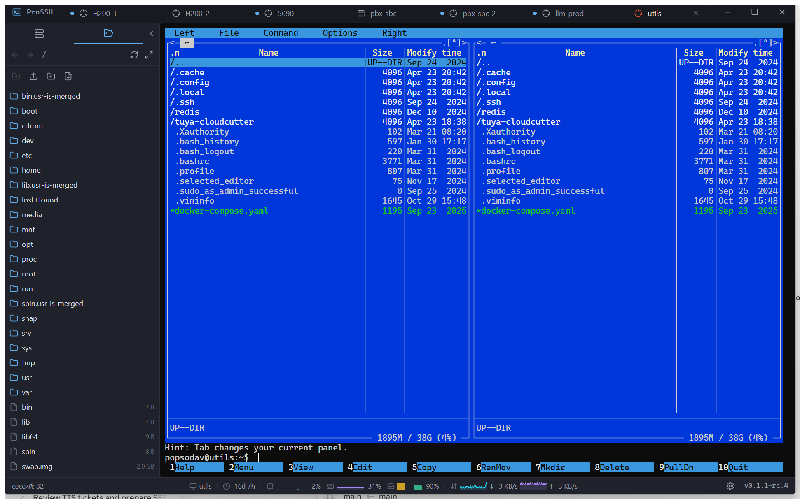

# ProSSH

> Modern cross-platform SSH / SFTP client with tabs, split panes, a built‑in file manager and OS‑keychain‑backed credentials.

[](https://github.com/yavlenie-pro/prossh/actions/workflows/ci.yml)
[](https://github.com/yavlenie-pro/prossh/actions/workflows/release.yml)

**English** · [Русский](./README.ru.md) · [中文](./README.zh.md)

ProSSH is a desktop SSH client written in Rust + React on top of [Tauri 2](https://tauri.app/). It packs a fast WebGL terminal ([xterm.js](https://xtermjs.org/)), an SFTP panel, server‑to‑server copy, port forwarding and one‑click imports from PuTTY, MobaXterm and `~/.ssh/config` — all in a ~15 MB native binary.



---

## Features

- **Tabbed terminal** with split panes (horizontal / vertical), WebGL renderer, Unicode 11, search and URL detection.
- **SFTP file browser** — dual‑pane, drag‑and‑drop upload/download, rename, delete, `chmod`, create file/dir, edit in external editor with auto‑upload on save.
- **Server‑to‑server copy** — direct `rsync`/`scp` between two servers via a guided wizard (installs missing tools, generates a temporary key, cleans up after).
- **Port forwarding** — local (`-L`) and remote (`-R`) tunnels per session, activated automatically on connect.
- **Session management** — sessions grouped in folders, per‑session color, last‑used sorting, duplicate, rename, bulk dedup.
- **Imports** — `~/.ssh/config`, PuTTY (Windows Registry), MobaXterm (Registry or `.mxtsessions` file) with folder → group mapping.
- **Secure credentials** — passwords and key passphrases live in the OS keychain (Windows Credential Manager, macOS Keychain, libsecret on Linux). Nothing sensitive ever lands on disk in plaintext.
- **Known hosts** — TOFU (trust‑on‑first‑use) with explicit fingerprint confirmation, mismatch refusal, and a UI to revoke individual keys.
- **Authentication** — password, private key (with passphrase prompt), or `ssh-agent`.
- **Color profiles** — built‑in Windows Terminal / iTerm / Solarized style themes plus custom profiles.
- **Command palette** (`Ctrl+Shift+P`) for fuzzy‑search over sessions, scripts and actions.
- **Scripts** — reusable bash snippets scoped globally or per session, fired straight into the terminal.
- **Remote system widgets** — optional CPU / RAM / disk / uptime readout per session.
- **i18n** — English, Russian and Simplified Chinese UI out of the box.

See [**docs/USER_GUIDE.md**](./docs/USER_GUIDE.md) for the full feature walkthrough.

## Download

Signed installers for every platform are attached to each [GitHub Release](https://github.com/yavlenie-pro/prossh/releases):

| Platform | Artifacts |
| --- | --- |
| Windows | `ProSSH_*_x64-setup.exe` (NSIS, multilingual — EN / RU / ZH), `ProSSH_*_x64_en-US.msi`, `_ru-RU.msi`, `_zh-CN.msi` |
| macOS | `ProSSH_*_aarch64.dmg`, `ProSSH_*_x64.dmg` |
| Linux | `prossh_*_amd64.deb`, `prossh_*_amd64.AppImage` |

Stable releases are built automatically from git tags `v*` by the [release workflow](./.github/workflows/release.yml).

## Quick start

1. Install the package for your OS from the latest release.
2. Launch **ProSSH**.
3. Click **New session**, fill in host / user / auth, hit **Save**.
4. Press **Connect** (or `Enter` on the selected session) — ProSSH negotiates the host key, prompts you for it on first use, opens a terminal tab.
5. Switch the sidebar to **Files** to get an SFTP panel for the same connection.

Keyboard shortcuts:

| Shortcut | Action |
| --- | --- |
| `Ctrl+Shift+P` | Command palette |
| `Ctrl+Shift+T` | New tab for the selected session |
| `Ctrl+W` | Close active tab |
| `Ctrl+Shift+D` | Split pane horizontally |
| `Ctrl+Shift+E` | Split pane vertically |
| `Ctrl+B` | Toggle sidebar |

## Building from source

```bash
# prerequisites: Node.js 20+, Rust 1.80+, platform webview/build deps (see docs/DEVELOPMENT.md)
npm ci
npm run tauri dev      # hot-reloaded dev build
npm run tauri build    # release bundle in src-tauri/target/release/bundle/
```

For the detailed build matrix (Windows MSVC, macOS Xcode, Linux `libwebkit2gtk-4.1`), code‑style rules and architecture overview see [**docs/DEVELOPMENT.md**](./docs/DEVELOPMENT.md).

## Tech stack

- **Backend** — Rust, [Tauri 2](https://tauri.app/), [Tokio](https://tokio.rs/), [russh](https://github.com/warp-tech/russh) (pure‑Rust SSH), [russh-sftp](https://github.com/AspectUnk/russh-sftp), [rusqlite](https://github.com/rusqlite/rusqlite) (bundled SQLite), [keyring](https://github.com/hwchen/keyring-rs), [tracing](https://github.com/tokio-rs/tracing).
- **Frontend** — React 18, TypeScript, Tailwind CSS, [xterm.js](https://xtermjs.org/) (WebGL), [Radix UI](https://www.radix-ui.com/), [Zustand](https://github.com/pmndrs/zustand), [cmdk](https://cmdk.paco.me/), [i18next](https://www.i18next.com/).
- **Persistence** — SQLite (session metadata, scripts, port forwards, color profiles, KV settings) under `%APPDATA%/prossh/` (Windows) / `~/Library/Application Support/prossh/` (macOS) / `~/.local/share/prossh/` (Linux). Secrets live in the OS keychain, not the database.

## Project status

Version 0.1.x — **MVP**. Terminal, SFTP, port forwarding, imports, color profiles and scripts are working. Monitoring widgets and a plugin API are planned for 0.2.

## License

ProSSH is released under the [PolyForm Noncommercial 1.0.0](./LICENSE) license — **free for personal and non-commercial use**.

**Commercial use** (including internal company use, consulting, hosting as a service, or embedding in a product) requires a separate license. Contact [mail@yavlenie.pro](mailto:mail@yavlenie.pro) for terms.

## Contributing

Issues and PRs welcome. Before opening a PR please read the [development guide](./docs/DEVELOPMENT.md) and run `npm run lint` + `cargo clippy -- -D warnings` locally.
